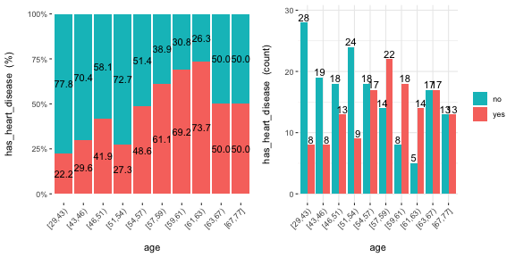
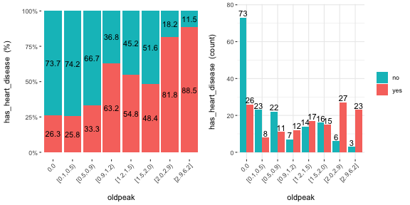
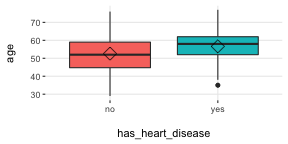
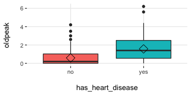
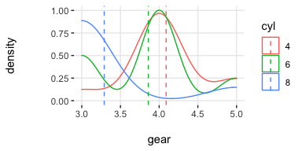

# funModeling quick-start {#quick_start}


This package contains a set of functions related to exploratory data analysis, data preparation, and model performance. It is used by people coming from business, research, and teaching (professors and students).

`funModeling` is intimately related to the _Data Science Live Book_ -Open Source- (2017) in the sense that most of its functionality is used to explain different topics addressed by the book.


## Opening the black-box 

Some functions have in-line comments so the user can open the black-box and learn how it was developed, or to tune or improve any of them. 

All the functions are well documented, explaining all the parameters with the help of many short examples. R documentation can be accessed by: `help("name_of_the_function")`.


<br>

### About this quick-start

This quick-start is focused only on the functions. All explanations around them, and the how and when to use them, can be accessed by following the "_**Read more here.**_" links below each section, which redirect you to the book.

Below there are most of the `funModeling` functions divided by category.

## Exploratory data analysis


### `status`: Dataset health status (2nd version)

Similar to `df_status`, but it returns all percentages in the 0 to 1 range (not 1 to 100). 


```r
library(funModeling)

status(heart_disease)
```

```
##                  variable q_zeros   p_zeros q_na       p_na q_inf p_inf    type unique
## 1                     age       0 0.0000000    0 0.00000000     0     0 integer     41
## 2                  gender       0 0.0000000    0 0.00000000     0     0  factor      2
## 3              chest_pain       0 0.0000000    0 0.00000000     0     0  factor      4
## 4  resting_blood_pressure       0 0.0000000    0 0.00000000     0     0 integer     50
## 5       serum_cholestoral       0 0.0000000    0 0.00000000     0     0 integer    152
## 6     fasting_blood_sugar     258 0.8514851    0 0.00000000     0     0  factor      2
## 7         resting_electro     151 0.4983498    0 0.00000000     0     0  factor      3
## 8          max_heart_rate       0 0.0000000    0 0.00000000     0     0 integer     91
## 9             exer_angina     204 0.6732673    0 0.00000000     0     0 integer      2
## 10                oldpeak      99 0.3267327    0 0.00000000     0     0 numeric     40
## 11                  slope       0 0.0000000    0 0.00000000     0     0 integer      3
## 12      num_vessels_flour     176 0.5808581    4 0.01320132     0     0 integer      4
## 13                   thal       0 0.0000000    2 0.00660066     0     0  factor      3
## 14 heart_disease_severity     164 0.5412541    0 0.00000000     0     0 integer      5
## 15           exter_angina     204 0.6732673    0 0.00000000     0     0  factor      2
## 16      has_heart_disease       0 0.0000000    0 0.00000000     0     0  factor      2
## 17                  score       0 0.0000000    0 0.00000000     0     0 numeric    211
```

Note: `df_status` will be deprecated, please use `status` instead.


### `data_integrity`: Dataset health status (2nd version)

A handy function to return different vectors of variable names aimed to quickly filter NA, categorical (factor / character), numerical and other types (boolean, date, posix). 

It also returns a vector of variables which have high cardinality. 

It returns an 'integrity' object, which has: 'status_now' (comes from status function), and 'results' list, following elements can be found: vars_cat, vars_num, vars_num_with_NA, etc. Explore the object for more.


```r
library(funModeling)

di=data_integrity(heart_disease)

# returns a summary
summary(di)
```

```
## 
## ◌ {Numerical with NA} num_vessels_flour
## ◌ {Categorical with NA} thal
```

```r
# print all the metadata information
print(di)
```

```
## $vars_num_with_NA
##            variable q_na       p_na
## 1 num_vessels_flour    4 0.01320132
## 
## $vars_cat_with_NA
##   variable q_na       p_na
## 1     thal    2 0.00660066
## 
## $vars_cat_high_card
## [1] variable unique  
## <0 rows> (or 0-length row.names)
## 
## $MAX_UNIQUE
## [1] 35
## 
## $vars_one_value
## character(0)
## 
## $vars_cat
## [1] "gender"              "chest_pain"          "fasting_blood_sugar" "resting_electro"    
## [5] "thal"                "exter_angina"        "has_heart_disease"  
## 
## $vars_num
##  [1] "age"                    "resting_blood_pressure" "serum_cholestoral"     
##  [4] "max_heart_rate"         "exer_angina"            "oldpeak"               
##  [7] "slope"                  "num_vessels_flour"      "heart_disease_severity"
## [10] "score"                 
## 
## $vars_char
## character(0)
## 
## $vars_factor
## [1] "gender"              "chest_pain"          "fasting_blood_sugar" "resting_electro"    
## [5] "thal"                "exter_angina"        "has_heart_disease"  
## 
## $vars_other
## character(0)
```

### `plot_num`: Plotting distributions for numerical variables

Plots only numeric variables.


```r
plot_num(heart_disease)
```


Notes:

* `bins`: Sets the number of bins (10 by default).
* `path_out` indicates the path directory; if it has a value, then the plot is exported in jpeg. To save in current directory path must be dot: "."

[**Read more here.**](https://livebook.datascienceheroes.com/exploratory-data-analysis.html#plotting-numerical-variable)


<br>

### `profiling_num`: Calculating several statistics for numerical variables

Retrieves several statistics for numerical variables.


```r
profiling_num(heart_disease)
```

```
##                  variable        mean    std_dev variation_coef        p_01        p_05        p_25
## 1                     age  54.4389439  9.0386624      0.1660330  35.0000000  40.0000000  48.0000000
## 2  resting_blood_pressure 131.6897690 17.5997477      0.1336455 100.0000000 108.0000000 120.0000000
## 3       serum_cholestoral 246.6930693 51.7769175      0.2098840 149.0000000 175.1000000 211.0000000
## 4          max_heart_rate 149.6072607 22.8750033      0.1529004  95.0200000 108.1000000 133.5000000
## 5             exer_angina   0.3267327  0.4697945      1.4378558   0.0000000   0.0000000   0.0000000
## 6                 oldpeak   1.0396040  1.1610750      1.1168436   0.0000000   0.0000000   0.0000000
## 7                   slope   1.6006601  0.6162261      0.3849825   1.0000000   1.0000000   1.0000000
## 8       num_vessels_flour   0.6722408  0.9374383      1.3944978   0.0000000   0.0000000   0.0000000
## 9  heart_disease_severity   0.9372937  1.2285357      1.3107265   0.0000000   0.0000000   0.0000000
## 10                  score   0.4587459  0.2263105      0.4933244   0.1454362   0.1753624   0.2616645
##          p_50        p_75        p_95        p_99   skewness kurtosis        iqr
## 1   56.000000  61.0000000  68.0000000  71.0000000 -0.2080241 2.465477 13.0000000
## 2  130.000000 140.0000000 160.0000000 180.0000000  0.7025346 3.845881 20.0000000
## 3  241.000000 275.0000000 326.9000000 406.7400000  1.1298741 7.398208 64.0000000
## 4  153.000000 166.0000000 181.9000000 191.9600000 -0.5347844 2.927602 32.5000000
## 5    0.000000   1.0000000   1.0000000   1.0000000  0.7388506 1.545900  1.0000000
## 6    0.800000   1.6000000   3.4000000   4.2000000  1.2634255 4.530193  1.6000000
## 7    2.000000   2.0000000   3.0000000   3.0000000  0.5057957 2.363050  1.0000000
## 8    0.000000   1.0000000   3.0000000   3.0000000  1.1833771 3.234941  1.0000000
## 9    0.000000   2.0000000   3.0000000   4.0000000  1.0532483 2.843788  2.0000000
## 10   0.403364   0.6230052   0.8652078   0.9411475  0.5504221 2.159351  0.3613407
##                                  range_98                               range_80
## 1                                [35, 71]                               [42, 66]
## 2                              [100, 180]                             [110, 152]
## 3                           [149, 406.74]                         [188.8, 308.8]
## 4                         [95.02, 191.96]                           [116, 176.6]
## 5                                  [0, 1]                                 [0, 1]
## 6                                [0, 4.2]                               [0, 2.8]
## 7                                  [1, 3]                                 [1, 2]
## 8                                  [0, 3]                                 [0, 2]
## 9                                  [0, 4]                                 [0, 3]
## 10 [0.145436166358477, 0.941147494151237] [0.198045330002735, 0.818579316365706]
```

Note: 

* `plot_num` and `profiling_num` automatically exclude non-numeric variables

[**Read more here.**](https://livebook.datascienceheroes.com/exploratory-data-analysis.html#numerical-profiling-in-r)

<br>

### `freq`: Getting frequency distributions for categoric variables 


```r
library(dplyr)

# Select only two variables for this example
heart_disease_2=heart_disease %>% select(chest_pain, thal)

# Frequency distribution
freq(heart_disease_2)
```


```
##   chest_pain frequency percentage cumulative_perc
## 1          4       144      47.52           47.52
## 2          3        86      28.38           75.90
## 3          2        50      16.50           92.40
## 4          1        23       7.59          100.00
```


```
##   thal frequency percentage cumulative_perc
## 1    3       166      54.79           54.79
## 2    7       117      38.61           93.40
## 3    6        18       5.94           99.34
## 4 <NA>         2       0.66          100.00
```

```
## [1] "Variables processed: chest_pain, thal"
```


Notes: 

* `freq` only processes `factor` and `character`, excluding non-categorical variables. 
* It returns the distribution table as a data frame.
* If `input` is empty, then it runs for all categorical variables.
* `path_out` indicates the path directory; if it has a value, then the plot is exported in jpeg. To save in current directory path must be dot: "."
* `na.rm` indicates if `NA` values should be excluded (`FALSE` by default).

[**Read more here.**](https://livebook.datascienceheroes.com/exploratory-data-analysis.html#profiling-categorical-variables)


<br>

## Correlation

### `correlation_table`: Calculates R statistic

Retrieves R metric (or Pearson coefficient) for all numeric variables, skipping the categoric ones. 


```r
correlation_table(heart_disease, "has_heart_disease")
```

```
##                  Variable has_heart_disease
## 1       has_heart_disease              1.00
## 2  heart_disease_severity              0.83
## 3       num_vessels_flour              0.46
## 4                   score              0.45
## 5                 oldpeak              0.42
## 6                   slope              0.34
## 7                     age              0.23
## 8  resting_blood_pressure              0.15
## 9       serum_cholestoral              0.08
## 10         max_heart_rate             -0.42
```

Notes: 

* Only numeric variables are analyzed. Target variable must be numeric.
* If target is categorical, then it will be converted to numeric.

[**Read more here.**](https://livebook.datascienceheroes.com/exploratory-data-analysis.html#linear-correlation)


<br>

### `var_rank_info`: Correlation based on information theory

Calculates correlation based on several information theory metrics between all variables in a data frame and a target variable.


```r
var_rank_info(heart_disease, "has_heart_disease")
```

```
##                       var    en    mi           ig           gr
## 1  heart_disease_severity 1.846 0.995 0.9950837595 0.5390655068
## 2                    thal 2.032 0.209 0.2094550580 0.1680456709
## 3             exer_angina 1.767 0.139 0.1391389302 0.1526393841
## 4            exter_angina 1.767 0.139 0.1391389302 0.1526393841
## 5              chest_pain 2.527 0.205 0.2050188327 0.1180286190
## 6       num_vessels_flour 2.381 0.182 0.1815217813 0.1157736478
## 7                   score 7.730 0.743 0.7429175154 0.0993452780
## 8                   slope 2.177 0.112 0.1124219069 0.0868799615
## 9       serum_cholestoral 7.481 0.561 0.5605556771 0.0795557228
## 10                 gender 1.842 0.057 0.0572537665 0.0632970555
## 11                oldpeak 4.874 0.249 0.2491668741 0.0603576874
## 12         max_heart_rate 6.832 0.334 0.3336174096 0.0540697329
## 13 resting_blood_pressure 5.567 0.143 0.1425548155 0.0302394591
## 14                    age 5.928 0.137 0.1371752885 0.0270548944
## 15        resting_electro 2.059 0.024 0.0241482908 0.0221938072
## 16    fasting_blood_sugar 1.601 0.000 0.0004593775 0.0007579095
```

Note: It analyzes numerical and categorical variables. It is also used with the numeric discretization method as before, just as `discretize_df`.


[**Read more here.**](https://livebook.datascienceheroes.com/selecting-best-variables.html#select_features_var_rank_info)


<br>

### `cross_plot`: Distribution plot between input and target variable

Retrieves the relative and absolute distribution between an input and target variable. 
Useful to explain and report if a variable is important or not.


```r
cross_plot(data=heart_disease, input=c("age", "oldpeak"), target="has_heart_disease")
```

```
## Plotting transformed variable 'age' with 'equal_freq', (too many values). Disable with 'auto_binning=FALSE'
```

```
## Plotting transformed variable 'oldpeak' with 'equal_freq', (too many values). Disable with 'auto_binning=FALSE'
```



Notes: 

* `auto_binning`: `TRUE` by default, shows the numerical variable as categorical.
* `path_out` indicates the path directory; if it has a value, then the plot is exported in jpeg.
* `input` can be numeric or categoric, and `target` must be a binary (two-class) variable.
* If `input` is empty, then it runs for all variables.

[**Read more here.**](https://livebook.datascienceheroes.com/selecting-best-variables.html#profiling_target_cross_plot)

<br>

### `plotar`: Boxplot and density histogram between input and target variables

Useful to explain and report if a variable is important or not. 

**Boxplot:**


```r
plotar(data=heart_disease, input = c("age", "oldpeak"), target="has_heart_disease", plot_type="boxplot")
```



[**Read more here.**](https://livebook.datascienceheroes.com/selecting-best-variables.html#target-profiling-using-boxplots)

<br>

**Density histograms:**


```r
plotar(data=mtcars, input = "gear", target="cyl", plot_type="histdens")
```



[**Read more here.**](https://livebook.datascienceheroes.com/selecting-best-variables.html#target-profiling-using-density-histograms)

Notes:

* `path_out` indicates the path directory; if it has a value, then the plot is exported in jpeg.
* If `input` is empty, then it runs for all numeric variables (skipping the categorical ones).
* `input` must be numeric and target must be categoric.
* `target` can be multi-class (not only binary).

<br>

### `categ_analysis`: Quantitative analysis for binary outcome

Profile a binary target based on a categorical input variable, the representativeness (`perc_rows`) and the accuracy (`perc_target`) for each value of the input variable; for example, the rate of flu infection per country.


```r
df_ca=categ_analysis(data = data_country, input = "country", target = "has_flu")

head(df_ca)
```

```
##          country mean_target sum_target perc_target q_rows perc_rows
## 1       Malaysia       1.000          1       0.012      1     0.001
## 2         Mexico       0.667          2       0.024      3     0.003
## 3       Portugal       0.200          1       0.012      5     0.005
## 4 United Kingdom       0.178          8       0.096     45     0.049
## 5        Uruguay       0.175         11       0.133     63     0.069
## 6         Israel       0.167          1       0.012      6     0.007
```
    
Note: 

* `input` variable must be categorical.
* `target` variable must be binary (two-value).

This function is used to analyze data when we need to reduce variable cardinality in predictive modeling.

[**Read more here.**](https://livebook.datascienceheroes.com/data-preparation.html#high_cardinality_predictive_modeling)


## Data preparation

### Data discretization

#### `discretize_get_bins` + `discretize_df`: Convert numeric variables to categoric

We need two functions: `discretize_get_bins`, which returns the thresholds for each variable, and then `discretize_df`, which takes the result from the first function and converts the desired variables. The binning criterion is equal frequency.

Example converting only two variables from a dataset.


```r
# Step 1: Getting the thresholds for the desired variables: "max_heart_rate" and "oldpeak"
d_bins=discretize_get_bins(data=heart_disease, input=c("max_heart_rate", "oldpeak"), n_bins=5)
```

```
## Variables processed: max_heart_rate, oldpeak
```

```r
# Step 2: Applying the threshold to get the final processed data frame
heart_disease_discretized=discretize_df(data=heart_disease, data_bins=d_bins, stringsAsFactors=T)
```

```
## Variables processed: max_heart_rate, oldpeak
```

The following image illustrates the result. Please note that the variable name remains the same.


Notes: 

* This two-step procedure is thought to be used in production with new data.
* Min and max values for each bin will be `-Inf` and `Inf`, respectively.
* A fix in the latest `funModeling` release (1.6.7) may change the output in certain scenarios. Please check the results if you were using version 1.6.6. More info about this change [here](https://s3.amazonaws.com/datascienceheroes.com/img/blog/changes_discretize_df.png).

[**Read more here.**](https://livebook.datascienceheroes.com/data-preparation.html#data-discretization)


<br>

### `equal_freq`: Convert numeric variable to categoric

Converts numeric vector into a factor using the equal frequency criterion.


```r
new_age=equal_freq(heart_disease$age, n_bins = 5)

# checking results
Hmisc::describe(new_age)
```

```
## new_age 
##        n  missing distinct 
##      303        0        5 
## 
## lowest : [29,46) [46,54) [54,59) [59,63) [63,77], highest: [29,46) [46,54) [54,59) [59,63) [63,77]
##                                                   
## Value      [29,46) [46,54) [54,59) [59,63) [63,77]
## Frequency       63      64      71      45      60
## Proportion   0.208   0.211   0.234   0.149   0.198
```

[**Read more here.**](https://livebook.datascienceheroes.com/data-preparation.html#equal-frequency-binning)

Notes:

* Unlike `discretize_get_bins`, this function doesn't insert `-Inf` and `Inf` as the min and max value respectively.

<br>

### `discretize_rgr`: Variable discretization based on gain ratio maximization

This is a new method developed in `funModeling` developed improve the binning based on a binary target variable.


```r
input=heart_disease$oldpeak
target=heart_disease$has_heart_disease

input2=discretize_rgr(input, target)

# checking:
summary(input2)
```

```
## [0.0,0.6) [0.6,1.0) [1.0,1.4) [1.4,1.9) [1.9,6.2] 
##       135        31        34        39        64
```

Adjust max number of bins with: `max_n_bins`; `5` as default.
Control minimum sample size per bin with `min_perc_bins`; `0.1` (or 10%) as default)


### `range01`: Scales variable into the 0 to 1 range 

Convert a numeric vector into a scale from 0 to 1 with 0 as the minimum and 1 as the maximum.


```r
age_scaled=range01(heart_disease$oldpeak)

# checking results
summary(age_scaled)
```

```
##    Min. 1st Qu.  Median    Mean 3rd Qu.    Max. 
##  0.0000  0.0000  0.1290  0.1677  0.2581  1.0000
```

<br>

## Outliers data preparation

### `hampel_outlier` and  `tukey_outlier`: Gets outliers threshold

Both functions retrieve a two-value vector that indicates the thresholds for which the values are considered as outliers.
The functions `tukey_outlier` and `hampel_outlier` are used internally in `prep_outliers`.


**Using Tukey's method:**


```r
tukey_outlier(heart_disease$resting_blood_pressure)
```

```
## bottom_threshold    top_threshold 
##               60              200
```

[**Read more here.**](https://livebook.datascienceheroes.com/data-preparation.html#detecting-outliers-using-tukey-method)

<br>

**Using Hampel's method:**


```r
hampel_outlier(heart_disease$resting_blood_pressure)
```

```
## bottom_threshold    top_threshold 
##           85.522          174.478
```

[**Read more here.**](https://livebook.datascienceheroes.com/data-preparation.html#detecting-outliers-using-hampel-method)


<br>

### `prep_outliers`: Prepare outliers in a data frame

Takes a data frame and returns the same data frame plus the transformations specified in the `input` parameter. It also works with a single vector.

Example considering two variables as input:


```r
# Get threshold according to Hampel's method
hampel_outlier(heart_disease$max_heart_rate)
```

```
## bottom_threshold    top_threshold 
##           86.283          219.717
```

```r
# Apply function to stop outliers at the threshold values
data_prep=prep_outliers(data = heart_disease, input = c('max_heart_rate','resting_blood_pressure'), method = "hampel", type='stop')
```

Checking the before and after for variable `max_heart_rate`:


```
## [1] "Before transformation -> Min: 71; Max: 202"
```

```
## [1] "After transformation -> Min: 71; Max: 202"
```

The min value changed from 71 to 86.23, while the max value remained the same at 202.

Notes:

* `method` can be: `bottom_top`, `tukey` or `hampel`.
* `type` can be: `stop` or `set_na`. If `stop` all values flagged as outliers will be set to the threshold. If `set_na`, then the flagged values will set to `NA`.

[**Read more here.**](https://livebook.datascienceheroes.com/data-preparation.html#analyze-binary-outcome-vs-categorical-variable)


<br>

## Predictive model performance

### `gain_lift`: Gain and lift performance curve

After computing the scores or probabilities for the class we want to predict, we pass it to the `gain_lift` function, which returns a data frame with performance metrics.


```r
# Create machine learning model and get its scores for positive case 
fit_glm=glm(has_heart_disease ~ age + oldpeak, data=heart_disease, family = binomial)
heart_disease$score=predict(fit_glm, newdata=heart_disease, type='response')

# Calculate performance metrics
gain_lift(data=heart_disease, score='score', target='has_heart_disease')
```


```
##    Population   Gain Lift Score.Point
## 1          10  20.86 2.09   0.8185793
## 2          20  35.97 1.80   0.6967124
## 3          30  48.92 1.63   0.5657817
## 4          40  61.15 1.53   0.4901940
## 5          50  69.06 1.38   0.4033640
## 6          60  78.42 1.31   0.3344170
## 7          70  87.77 1.25   0.2939878
## 8          80  92.09 1.15   0.2473671
## 9          90  96.40 1.07   0.1980453
## 10        100 100.00 1.00   0.1195511
```

[**Read more here.**](https://livebook.datascienceheroes.com/model-performance.html#gain_and_lift)

<br>


---

* Github repository (report bugs or improvements): https://github.com/pablo14/funModeling
* Creator and maintainer: Pablo Casas https://twitter.com/pabloc_ds


